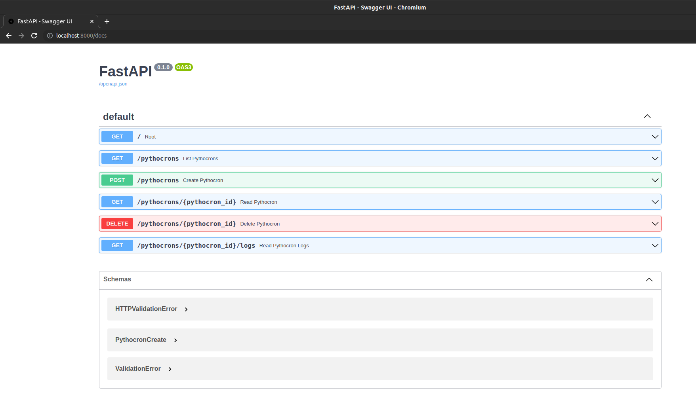
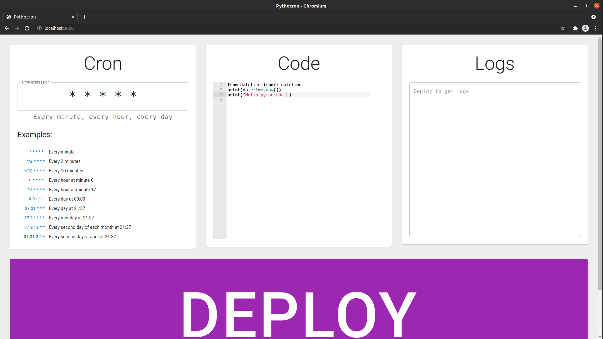

# Python + Cron = Pythocron

Purpose of this project is to enable simple scheduled code execution. It's like cloud functions + scheduler with jupyter-notebook-like interface and user-friendliness.

[](https://deploy.cloud.run?dir=backend)


## Running
Create `docker-compose.yml` file with below contents:
```
version: "3.0"
services:
  backend:
    image: oskarissimus/pythocron-backend
    ports:
      - "8000:8000"
  frontend:
    image: oskarissimus/pythocron-frontend
    ports:
      - "5000:5000"
```

Than run:
```
docker-compose up
```
## Building docker images from repo
```
# Cloning repo
git clone https://github.com/oskarissimus/pythocron.git
cd pythocron

# Just docker-compose up :)
docker-compose up
```

Than go to http://localhost:5000

You can also use backend directly http://localhost:8000/docs

## Running dev
### backend
```
# please use virtual envs for own sanity
cd backend
mkvirtualenv pythocron
pip install -r requrements.txt
poetry isntall
poetry run uvicorn pythocron.main:app --host=0.0.0.0 --reload
# project uses crontab as root, so have that in mind while running dev
```
### frontend
```
cd frontend
# Installing frontend dependencies
npm install

# Running frontend in dev mode
npm start
```
To stop, just exit `npm start` with `ctrl-c`

## General architecture
### Backend

Backend is written in Python 3.8 + Fastapi. Poetry is responsible for dependency management. Python-crontab provides python interface for cron management.

Backend is wrapped in docker image. It is based on python:3.8-slim-buster. Tini is utilized to solve problems with running two services in container (cron and uvicorn for fastapi)

After starting backend there are auto-generated interactive docs on `localhost:8000/docs`




### Frontend
Frontend is made in React js.




## Contributing
Feel free to fork, create pull requests, and submit issues. This project is just starting, so there are a lot of bugs. If You find one, please create an issue, I will try to fix it!


## Todo list
- [x] Create route `/{pythocron_id}` in frontend to show particular pythocron
- [x] Display list of uploaded pythocrons
- [x] Handle deleting pythocrons
- [x] docker-compose
- [x] Responsive design
- [x] Handle updating pythocrons
- [ ] Handle deactivating pythocrons
- [ ] Publish to docker hub
- [ ] Unit testing for backend
- [ ] Configure github actions to automathically build test and push to docker hub
